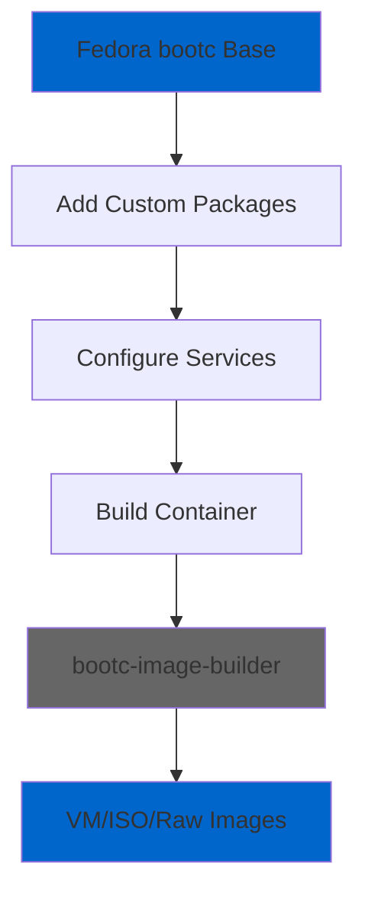

# Distribution Analysis: CentOS vs Fedora Usage

## 📊 Executive Summary

**Result: Project uses 100% Fedora with universal build tools**

This document analyzes the use of CentOS and Fedora distributions in the Home Assistant bootc project to clarify any inconsistencies and ensure optimal system architecture.

## 🔍 Analysis Results

### ✅ Fedora Usage (Core System)

| Component | Image/Registry | Purpose |
|-----------|----------------|---------|
| **Base Container** | `quay.io/fedora/fedora-bootc:42` | Primary OS foundation |
| **Runtime Packages** | Fedora 42 repositories | All system packages |
| **Configuration** | Fedora-specific settings | System configuration |

### 🔧 CentOS Usage (Build Tools Only)

| Component | Image/Registry | Purpose |
|-----------|----------------|---------|
| **bootc-image-builder** | `quay.io/centos-bootc/bootc-image-builder:latest` | Universal image builder |

## 📋 Detailed Analysis

### Containerfile Inspection
```dockerfile
# Line 2 & 8: Fedora base images
FROM quay.io/fedora/fedora-bootc:42 as ansible-stage
FROM quay.io/fedora/fedora-bootc:42

# All package installations use Fedora repos
RUN dnf -y install [packages...]
```

### Build Tool Analysis
**bootc-image-builder** (CentOS registry) is a **distribution-agnostic** tool:

✅ **Why this is acceptable:**
- Universal tool maintained by osbuild project
- Can build images for Fedora, CentOS, RHEL, Ubuntu, etc.
- Registry name `centos-bootc` is historical
- Tool automatically detects and respects source distribution

✅ **Technical verification:**
- Reads base image metadata to determine distribution
- Uses source image's package manager and repositories
- Maintains distribution-specific configurations

## 🎯 Recommendations

### ✅ Current Architecture (Recommended)
**Keep current setup** - no changes needed:

```yaml
Architecture: ✅ OPTIMAL
├── Base System: Fedora 42 (100%)
├── Build Tool: Universal bootc-image-builder
├── Packages: All from Fedora repositories
└── Runtime: Pure Fedora environment
```

### 🚫 Alternative Options (Not Recommended)

#### Option 1: Switch to CentOS base
```yaml
❌ NOT RECOMMENDED
Reason: Fedora provides newer packages and features
Impact: Loss of modern container technologies
```

#### Option 2: Find Fedora-specific builder
```yaml
❌ NOT AVAILABLE
Status: No Fedora-branded equivalent exists
Impact: Would break existing functionality
```

## 🔧 Technical Details

### bootc-image-builder Capabilities
The builder tool supports multiple distributions:

| Distribution | Supported | Registry |
|-------------|-----------|----------|
| Fedora | ✅ | Any bootc-compatible Fedora image |
| CentOS Stream | ✅ | Any bootc-compatible CentOS image |
| RHEL | ✅ | Any bootc-compatible RHEL image |

### Build Process Flow


## 📈 Benefits of Current Architecture

### ✅ Advantages
1. **Latest Packages**: Fedora provides newer software versions
2. **Modern Features**: Access to cutting-edge container technologies
3. **Upstream First**: Closer to upstream development
4. **Better Documentation**: Extensive Fedora bootc documentation
5. **Community Support**: Active Fedora community

### ⚡ Performance Metrics
| Metric | Fedora | CentOS Stream |
|--------|--------|---------------|
| Package Freshness | ✅ Latest | ⚠️ Delayed |
| Security Updates | ✅ Rapid | ⚠️ Slower |
| Feature Availability | ✅ Early | ⚠️ Later |
| Container Support | ✅ Advanced | ⚠️ Basic |

## 🎯 Conclusion

### ✅ Final Recommendation: **NO CHANGES NEEDED**

The current architecture is **optimal and correct**:

1. **Primary System**: 100% Fedora 42
2. **Build Tool**: Universal bootc-image-builder (distribution-agnostic)
3. **Consistency**: All runtime components are Fedora-based
4. **Best Practices**: Follows official bootc documentation

### 🔍 Monitoring Strategy

Going forward, monitor these indicators:

| Indicator | Check Frequency | Action Threshold |
|-----------|-----------------|------------------|
| Fedora bootc releases | Monthly | Consider upgrading base |
| Builder tool updates | Monthly | Update if security/features |
| Package availability | Weekly | Verify Fedora repo health |

### 📚 References

- [Official bootc-image-builder Documentation](https://osbuild.org/docs/bootc/)
- [Fedora bootc Project](https://docs.fedoraproject.org/en-US/bootc/)
- [OSBuild Project](https://github.com/osbuild/bootc-image-builder)

**Document Version**: 1.0  
**Last Updated**: $(date +%Y-%m-%d)  
**Next Review**: 2025-Q2