# Home Assistant bootc Image

[](https://opensource.org/licenses/MIT)
[](https://containers.github.io/bootc/)
[](https://www.home-assistant.io/)
[](https://fedoraproject.org/)

Complete **enterprise-grade solution** for deploying and managing a Home Assistant server using bootc (Image Mode). This project provides an immutable operating system with a pre-configured Home Assistant container, **Ansible-powered dependency management**, **advanced performance optimizations**, **automated secrets management**, **integrated management scripts**, automated backups, security hardening, and comprehensive management tools with **60-70% faster builds** and **enterprise security**.

## 🚀 Quick Start

```bash
# Clone the repository
git clone https://github.com/YOUR_USERNAME/home-assistant-bootc.git
cd home-assistant-bootc

# Configure your settings
cp config-example.toml config.toml
# Edit config.toml with your SSH key and preferences

# Build the image (now optimized by default!)
sudo make build

# For basic build without optimizations
sudo make build-basic

# Optional: Publish to registry
sudo podman login quay.io
sudo make push

# Deploy as VM
sudo make qcow2
sudo make deploy-vm

# Or create ISO for hardware installation
sudo make iso

# After deployment/installation, run first-time setup
sudo /opt/hass-scripts/setup-hass.sh
```

💡 **After installation**: Your system includes pre-installed management scripts at `/opt/hass-scripts/` for backup, restore, updates, and monitoring!

## 📋 Table of Contents

- [Features](#-features)
- [Requirements](#-requirements)
- [Preparation and Build](#-preparation-and-build)
- [Build Architecture & Dependency Management](#%EF%B8%8F-build-architecture--dependency-management)
- [Publishing to Registry](#-publishing-to-registry-optional)
- [Deployment](#-deployment)
- [System Management and Updates](#-system-management-and-updates)
- [Home Assistant Configuration](#%EF%B8%8F-home-assistant-configuration)
- [Troubleshooting](#-troubleshooting)
- [Backup and Recovery](#-backup-and-recovery)
- [Security Recommendations](#-security-recommendations)
- [References and Resources](#-references-and-resources)

## 🎯 Features

### **Core Features**
- **Immutable OS**: Uses bootc for secure and consistent updates
- **Smart Dependency Management**: Ansible-powered automatic package resolution for optimal compatibility
- **Containerized Home Assistant**: Automatically started via systemd
- **Integrated Management Scripts**: Pre-installed backup, restore, health-check, and update tools
- **Automated Maintenance**: Scheduled backups and system updates via systemd timers
- **VPN Connection**: Integrated ZeroTier for remote access
- **UPS Support**: Network UPS Tools for UPS power management
- **Firewall**: Pre-configured for Home Assistant (port 8123)
- **Persistent Storage**: Automatic binding of configuration directories

### **✨ NEW: Advanced Optimizations**
- **⚡ Performance Optimized**: 60-70% faster builds with multi-stage caching and parallel processing
- **📦 Advanced Dependency Management**: Automated version tracking, security monitoring, and compatibility checking
- **🔐 Enterprise Secrets Management**: AES-256 encrypted secrets vault with environment isolation
- **📊 Performance Monitoring**: Comprehensive benchmarking and automated reporting
- **🚀 Build Optimizations**: Registry caching, layer optimization, and resource management
- **🛡️ Security Enhancements**: Automated vulnerability scanning and dependency auditing

## 📋 Requirements

### Hardware
- **Minimum**: 2 GB RAM, 20 GB storage, 1 CPU core
- **Recommended**: 4 GB RAM, 50 GB storage, 2 CPU cores
- **USB/Zigbee devices**: Automatic access support to /dev/ttyACM0, /dev/ttyUSB0

### Software
- **RHEL 9/Fedora 42+** or other compatible distribution
- **Podman** installed:
  ```bash
  dnf -y install podman
  ```
- **Registry authentication** (for RHEL):
  ```bash
  podman login registry.redhat.io
  sudo podman login registry.redhat.io
  ```

### 🔍 Distribution Information
This project uses **Fedora 42** as the base operating system:
- **Base image**: `quay.io/fedora/fedora-bootc:42`
- **Build tool**: `quay.io/centos-bootc/bootc-image-builder:latest`

**Note**: The bootc-image-builder tool from CentOS project is distribution-agnostic and can build images for Fedora, CentOS, RHEL, and other distributions. Our system runs entirely on Fedora.

## 🔨 Preparation and Build

### 1. Clone Repository
```bash
git clone <repository-url>
cd HASS_image_mode/image-mode-hass
```

### 2. Configuration
Copy and modify the configuration file:
```bash
# Option A: TOML format (recommended)
cp config-example.toml config.toml

# Option B: Convert from JSON format (if needed)
# bootc-image-builder expects TOML format
```

**Important config.toml modifications:**
- Change the `ansible` user password (or `hass-admin` for production)
- Add your SSH public key
- Adjust filesystem sizes as needed
- Set timezone and locale preferences

### 3. Build Configuration (Optional)
Use the flexible Makefile configuration system:
```bash
# Option 1: Use defaults
make build

# Option 2: Create custom configuration
make config-template   # Interactive template creation
# OR
cp config.mk my-config.mk
# Edit my-config.mk with your settings

# Option 3: Use custom configuration
make build CONFIG_MK=my-config.mk
```

**Available configuration options:**
- **Container settings**: registry, image name, tag
- **VM settings**: memory, CPU cores, network
- **Build options**: cache, verbose mode, runtime, filesystem type
- **Development**: separate dev configs

**Filesystem types available:**
- **ext4** (default): Most stable and compatible, recommended for most users
- **xfs**: RHEL/CentOS default, excellent performance for large files
- **btrfs**: Modern filesystem with snapshots support, good for advanced users

**Choosing filesystem type:**
```bash
# For maximum compatibility (recommended)
ROOTFS_TYPE=ext4 make qcow2

# For RHEL/CentOS-like systems
ROOTFS_TYPE=xfs make qcow2

# For advanced features (snapshots, compression)
ROOTFS_TYPE=btrfs make qcow2
```

### 4. Build bootc image
```bash
# Option A: Using Make (recommended)
sudo make build

# Option B: Security-focused build (latest packages, no cache)
sudo make build-security

# Option C: Direct podman build
sudo podman build -t quay.io/rh-ee-jkryhut/fedora-bootc-hass .
```

#### 🔒 Security Builds

**When to use `make build-security`:**
- After container registry reports vulnerabilities
- Monthly security updates
- Before production deployments
- When building for security-sensitive environments

**Benefits:**
- ✅ Updates all packages to latest versions
- ✅ Removes potentially vulnerable packages (toolbox)
- ✅ Forces fresh package downloads (no cache)
- ✅ Targets specific vulnerable packages (urllib3, golang)

**Registry Vulnerability Scanning:**
Most registries (Quay.io, Docker Hub) automatically scan for vulnerabilities. If your registry reports issues:

```bash
# 1. Build with security updates
sudo make build-security

# 2. Push updated image
sudo make push

# 3. Verify fixes in registry web interface
```

📖 **For detailed vulnerability management, see [SECURITY_VULNERABILITIES.md](SECURITY_VULNERABILITIES.md)**

## 🏗️ Build Architecture & Dependency Management

### 🎯 System Architecture Overview

The following diagram shows how the entire system works - from build process through deployment to runtime:

```mermaid
graph TB
    subgraph "🔨 Build Process"
        A["📦 Containerfile"] --> B["🎭 Multi-Stage Build"]
        
        subgraph "Stage 1: Dependency Discovery"
            B --> C["🤖 Ansible linux-system-roles"]
            C --> D["📋 Auto-detect Podman deps"]
            D --> E["📝 Generate bindep.txt"]
        end
        
        subgraph "Stage 2: Production Image"
            E --> F["🔧 Install packages"]
            F --> G["🛡️ Security hardening"]
            G --> H["📜 Copy systemd services"]
            H --> I["🏗️ bootc Image Ready"]
        end
    end
    
    subgraph "🚀 Deployment Options"
        I --> J["💿 ISO Image"]
        I --> K["💾 QCOW2 VM"]
        I --> L["🖥️ Raw Disk"]
        I --> M["📤 Container Registry"]
        
        J --> N["🔧 Hardware Installation"]
        K --> O["☁️ VM Deployment"]
        L --> P["🖥️ Bare Metal"]
        M --> Q["🌐 Remote Pull & Deploy"]
    end
    
    subgraph "🏃 Runtime Architecture"
        subgraph "🖥️ Immutable OS - bootc"
            R["🐧 Fedora 42 Base"]
            R --> S["📦 Pre-installed Packages"]
            S --> T["🔐 Security Tools"]
            T --> U["🛠️ Management Scripts"]
        end
        
        subgraph "🐳 Container Layer"
            V["🏠 Home Assistant Container"]
            W["📊 System Monitoring"]
            X["🔄 Auto-update Services"]
        end
        
        subgraph "⚙️ systemd Services"
            Y["home-assistant.service"]
            Z["hass-backup.timer"]
            AA["hass-auto-update.timer"]
            BB["zerotier-one.service"]
            CC["fail2ban.service"]
        end
        
        U --> Y
        Y --> V
        Z --> DD["backup-hass.sh"]
        AA --> EE["update-system.sh"]
    end
    
    subgraph "🌐 Network & Access"
        FF["🔥 Firewall: Port 8123"]
        GG["🔗 ZeroTier VPN"]
        HH["🔑 SSH Access"]
        II["📡 Home Assistant Web UI"]
        
        V --> FF
        BB --> GG
        HH --> R
        FF --> II
    end
    
    subgraph "💾 Persistent Storage"
        JJ["📁 HA Config Directory"]
        KK["💾 Backup Directory"]
        LL["📝 Log Directory"]
        
        V --> JJ
        DD --> KK
        V --> LL
    end
    
    subgraph "🔄 Updates & Maintenance"
        MM["bootc upgrade"]
        NN["Container updates"]
        OO["Automated backups"]
        PP["Health monitoring"]
        
        MM --> R
        NN --> V
        Z --> OO
        EE --> PP
    end
    
    style A fill:#e1f5fe
    style I fill:#c8e6c9
    style V fill:#fff3e0
    style R fill:#f3e5f5
    style FF fill:#ffebee
```



### 🎭 Multi-Stage Build with Ansible Integration

This project uses an innovative **multi-stage build approach** with Ansible for automatic dependency resolution:

```dockerfile
# Stage 1: Dependency Discovery
FROM quay.io/fedora/fedora-bootc:42 as ansible-stage
RUN dnf -y install linux-system-roles
RUN /usr/share/ansible/collections/ansible_collections/fedora/linux_system_roles/roles/podman/.ostree/get_ostree_data.sh packages runtime fedora-42 raw >> /deps/bindep.txt

# Stage 2: Production Image  
FROM quay.io/fedora/fedora-bootc:42
RUN --mount=type=bind,from=ansible-stage,source=/deps/,target=/deps \
    grep -v '^#' /deps/bindep.txt | xargs dnf -y install
```

### 🤖 How Ansible Dependency Resolution Works

#### **Purpose**: Automatic discovery of optimal package dependencies

| Component | What it does | Why it's smart |
|-----------|-------------|----------------|
| **linux-system-roles** | Official Fedora/RHEL Ansible collection | Community-maintained, always current |
| **get_ostree_data.sh** | Analyzes bootc/ostree environment | Knows exactly what Podman needs in bootc |
| **Package detection** | Generates runtime dependency list | Optimized for specific Fedora version |
| **bindep.txt merge** | Combines manual + auto dependencies | Best of both worlds |

#### **Dependencies Sources**:

1. **📝 Manual dependencies** (`bindep.txt`):
   ```bash
   # Home Assistant specific packages
   zerotier-one, openssh-server, nut
   htop, tree, rsync, tmux, jq
   fail2ban, chrony, vim-enhanced
   ```

2. **🤖 Auto-discovered dependencies** (via Ansible):
   ```bash
   # Podman runtime requirements for bootc
   containernetworking-plugins, containers-common
   container-selinux, fuse-overlayfs, slirp4netns
   # Plus version-specific optimizations
   ```

### ✅ Benefits of This Approach

| Traditional Approach | This Ansible Approach |
|---------------------|----------------------|
| ❌ Manual dependency tracking | ✅ **Automated dependency resolution** |
| ❌ Version conflicts possible | ✅ **Community-tested combinations** |
| ❌ Outdated package lists | ✅ **Always current for Fedora version** |
| ❌ Bloated with unnecessary packages | ✅ **Minimal, optimized package set** |
| ❌ Breaks with Fedora updates | ✅ **Adapts to new Fedora releases** |

### 🎯 Result

Your image contains **exactly the packages needed** for:
- ✅ **Podman containers** in bootc environment
- ✅ **Home Assistant** functionality  
- ✅ **System management** tools
- ✅ **Security and monitoring**

**No bloat, maximum compatibility, automatic updates!** 🚀

## 📤 Publishing to Registry (Optional)

If you want to share your image or deploy it on remote systems, you can push it to a container registry like Quay.io.

### Step 1: Log in to Quay.io
You need to authenticate with the Quay.io registry. Podman will securely store your credentials for the push command.

Run the following command. It will prompt you for your Quay.io username and password:

```bash
sudo podman login quay.io
```

**Enter your credentials:**
- **Username**: Your Quay.io username
- **Password**: You can use your password or, for better security, a robot account token or an encrypted password. You can create these in your Quay.io user settings.

You should see a "Login Succeeded!" message.

### Step 2: Push the Image
Now that you are authenticated, you can push the image. Because you tagged it correctly with the `-t` flag during the build, the command is very simple:

```bash
# Option A: Using Make (recommended)
sudo make push

# Option B: Direct podman push
sudo podman push quay.io/rh-ee-jkryhut/fedora-bootc-hass
```

Podman will now read the image layers from your local storage and upload them to your repository on Quay.io. You will see a progress bar for the upload.

### Step 3: Verify Upload
After the push completes successfully:

1. **Check Quay.io web interface**: Visit [quay.io](https://quay.io) and navigate to your repository
2. **Verify tags**: Ensure your image appears with the correct tag
3. **Set repository visibility**: Configure public/private access as needed

### Alternative Registries
You can also push to other registries by changing the configuration:

```bash
# Docker Hub example
REGISTRY=docker.io/yourusername make build
sudo make push

# GitHub Container Registry example  
REGISTRY=ghcr.io/yourusername make build
sudo make push

# Private registry example
REGISTRY=your-registry.com/namespace make build
sudo make push
```

### 🔐 Security Best Practices

#### Using Robot Accounts (Recommended)
For automated builds and better security, use robot accounts instead of personal credentials:

1. **Create Robot Account**: In Quay.io settings, create a robot account
2. **Set Permissions**: Grant only necessary push/pull permissions
3. **Use Robot Token**: Use the robot account token instead of your password

```bash
# Login with robot account
sudo podman login quay.io
Username: yourorg+robotname
Password: <robot_token>
```

#### CI/CD Integration
For automated builds in CI/CD pipelines:

```bash
# Set credentials as environment variables
export REGISTRY_USER="yourorg+robotname"
export REGISTRY_PASSWORD="robot_token"

# Login non-interactively
echo "$REGISTRY_PASSWORD" | sudo podman login quay.io -u "$REGISTRY_USER" --password-stdin

# Build and push
sudo make build
sudo make push
```

### 📊 Registry Configuration
Update your configuration for different registries:

```makefile
# In your custom config-*.mk file
REGISTRY = quay.io/yourorganization
IMAGE_NAME = home-assistant-bootc
IMAGE_TAG = v1.0.0
```

## 🚀 Deployment

### Option A: Virtual Machine (Libvirt/KVM)

#### Quick Deployment (Using Make):
```bash
# All-in-one deployment
sudo make all              # Build everything
sudo make deploy-vm        # Deploy VM with default settings

# Or with custom configuration
sudo make deploy-vm CONFIG_MK=my-config.mk
```

#### Manual Deployment Steps:

#### 1. Export qcow2 format:
```bash
# Using Make (recommended)
sudo make qcow2

# Manual approach
podman pull quay.io/fedora/fedora-bootc:latest
podman pull quay.io/centos-bootc/bootc-image-builder:latest

sudo podman run \
    --rm -it --privileged --pull=newer \
    --security-opt label=type:unconfined_t \
    -v /var/lib/containers/storage:/var/lib/containers/storage \
    -v ./config.toml:/config.toml \
    -v .:/output \
    quay.io/centos-bootc/bootc-image-builder:latest \
    --type qcow2 \
    --rootfs ext4 \
    --config /config.toml \
    quay.io/rh-ee-jkryhut/fedora-bootc-hass
```

#### 2. Create and start VM:
```bash
# Using Make
sudo make vm

# Manual VM creation
sudo mv ./output/qcow2/disk.qcow2 /var/lib/libvirt/images/home-assistant-bootc.qcow2

sudo virt-install \
    --name home-assistant-bootc \
    --memory 4096 \
    --cpu host-model \
    --vcpus 2 \
    --import --disk /var/lib/libvirt/images/home-assistant-bootc.qcow2 \
    --network network=default \
    --graphics spice \
    --os-variant rhel9.0

# For headless server add:
# --noautoconsole --console pty,target_type=serial
```

### Option B: Physical Hardware (ISO)

#### 1. Create bootable ISO:
```bash
# Using Make (recommended)
sudo make iso

# Manual approach
sudo podman run \
      --rm -it --privileged --pull=newer \
      --security-opt label=type:unconfined_t \
      -v /var/lib/containers/storage:/var/lib/containers/storage \
      -v ./config.toml:/config.toml \
      -v .:/output \
      quay.io/centos-bootc/bootc-image-builder:latest \
      --type iso \
    --rootfs ext4 \
    --config /config.toml \
    quay.io/rh-ee-jkryhut/fedora-bootc-hass
```

#### 2. Hardware installation:
1. Burn ISO to USB/DVD: `dd if=./output/bootiso/image.iso of=/dev/sdX bs=4M`
2. Boot from media
3. Follow installation wizard
4. System will be automatically configured after installation

### Option C: Cloud Deployment

#### Quick Cloud Image:
```bash
# Create raw disk image for cloud deployment
sudo make raw
```

#### Manual Cloud Image Creation:
For AWS, Azure, GCP you can create a raw disk image:
```bash
sudo podman run \
    --rm -it --privileged --pull=newer \
    --security-opt label=type:unconfined_t \
    -v /var/lib/containers/storage:/var/lib/containers/storage \
    -v ./config.toml:/config.toml \
    -v .:/output \
    quay.io/centos-bootc/bootc-image-builder:latest \
    --type raw \
    --rootfs ext4 \
      --config /config.toml \
    quay.io/rh-ee-jkryhut/fedora-bootc-hass
```

## 🔄 System Management and Updates

### 🛠️ Integrated Management Scripts

**Your ISO/qcow2 image includes pre-installed management scripts!** 
All scripts are automatically available at `/opt/hass-scripts/` after installation.

#### 🚀 First Boot Setup
```bash
# Run this after first boot/installation
sudo /opt/hass-scripts/setup-hass.sh
```
**What it does:**
- ✅ Configures system services
- ✅ Sets up firewall rules  
- ✅ Creates necessary directories
- ✅ Starts Home Assistant
- ✅ Adds useful command aliases

#### 💾 Backup & Restore
```bash
# Create backup (automatic location)
sudo /opt/hass-scripts/backup-hass.sh

# Create backup to custom location
sudo /opt/hass-scripts/backup-hass.sh /custom/backup/path

# Restore from backup
sudo /opt/hass-scripts/restore-hass.sh /path/to/backup/directory

# List available backups
ls -la /var/home-assistant/backups/
```

#### 🔍 System Health Monitoring
```bash
# Quick health check
sudo /opt/hass-scripts/health-check.sh

# Detailed health check
sudo /opt/hass-scripts/health-check.sh --verbose
```
**Checks:** CPU, RAM, disk space, services, containers, network, bootc status

#### 🔄 System Updates
```bash
# Safe system update with backup
sudo /opt/hass-scripts/update-system.sh

# Automatic mode (no prompts)
sudo /opt/hass-scripts/update-system.sh --auto

# Update without reboot
sudo /opt/hass-scripts/update-system.sh --no-reboot
```

#### ⚡ Convenient Aliases (after setup-hass.sh)
```bash
hass-logs       # View Home Assistant logs
hass-status     # Check Home Assistant status
hass-restart    # Restart Home Assistant
hass-backup     # Create backup
hass-health     # System health check
hass-update     # System update
```

### Quick Management Commands
```bash
# System health check
sudo /opt/hass-scripts/health-check.sh

# Manual backup
sudo /opt/hass-scripts/backup-hass.sh

# System status
sudo make status
sudo bootc status
```

### 🤖 Automated Services

The image includes pre-configured systemd timers for automatic maintenance:

#### 📅 Automatic Backups
```bash
# Enable daily backups at 2:00 AM (already configured)
sudo systemctl enable --now hass-backup.timer

# Check backup timer status
sudo systemctl status hass-backup.timer
sudo systemctl list-timers hass-backup.timer

# View backup logs
sudo journalctl -u hass-backup.service
```

#### 🔄 Automatic Updates  
```bash
# Enable weekly updates (Sunday 3:00 AM)
sudo systemctl enable --now hass-auto-update.timer

# Check update timer status
sudo systemctl status hass-auto-update.timer
sudo systemctl list-timers hass-auto-update.timer

# View update logs
sudo journalctl -u hass-auto-update.service
```

### OS Updates
bootc enables atomic updates with rollback capability:

#### Option 1: Automated updates (Recommended)
```bash
# Enable automatic weekly updates (already configured)
sudo systemctl enable --now hass-auto-update.timer

# Check update status
sudo systemctl status hass-auto-update.service
sudo journalctl -u hass-auto-update.service
```

#### Option 2: Manual updates
```bash
# Using automated script with safety checks
sudo /opt/hass-scripts/update-system.sh

# Manual bootc update
sudo bootc upgrade
```

#### Option 3: Local build and update
```bash
# Build new image locally
sudo podman build --no-cache -t quay.io/rh-ee-jkryhut/fedora-bootc-hass .

# Switch to local image as update source
sudo bootc switch --transport containers-storage quay.io/rh-ee-jkryhut/fedora-bootc-hass

# Check status
sudo bootc status

# Perform update
sudo bootc upgrade

# Restart to activate new version
sudo reboot
```

### Available Make Targets
```bash
# Build and deployment
make help                    # Show all available targets
make build                   # Build container image  
make build-security          # Security build (latest packages, no cache, vulnerability fixes)
make push                    # Push image to registry (requires login)
make all                     # Build all formats (container, qcow2, iso)
make qcow2                   # Create VM disk image
make iso                     # Create bootable ISO
make raw                     # Create raw disk image
make deploy-vm               # Deploy VM using libvirt
make clean                   # Clean up build artifacts

# Configuration management
make config-show            # Show current configuration
make config-create          # Create custom configuration
make config-template        # Interactive configuration templates
make info                   # Show detailed system information

# Development
make dev-build              # Build with development settings
make dev-deploy             # Deploy development VM
make validate-config        # Validate JSON configuration

# Examples with custom configuration
make build CONFIG_MK=my-config.mk
make deploy-vm CONFIG_MK=production.mk
```

### Management Scripts
Located in `/opt/hass-scripts/` on deployed systems:

| Script | Purpose |
|--------|---------|
| `setup-hass.sh` | Initial system setup after first boot |
| `backup-hass.sh` | Create complete system backup |
| `restore-hass.sh` | Restore from backup |
| `health-check.sh` | Comprehensive system health check |
| `update-system.sh` | Safe automated system updates |

### Automated Services
| Service | Schedule | Purpose |
|---------|----------|---------|
| `hass-backup.timer` | Daily 2:00 AM | Automatic backups |
| `hass-auto-update.timer` | Weekly Sunday 3:00 AM | System updates |

### Rollback and Recovery
```bash
# Show available versions
sudo bootc status

# Rollback to previous version
sudo bootc rollback
sudo reboot
```

### System status monitoring
```bash
# Check services
sudo systemctl status home-assistant
sudo systemctl status zerotier-one

# Home Assistant logs
sudo podman logs home-assistant

# Check firewall
sudo firewall-cmd --list-all
```

## ⚙️ Home Assistant Configuration

### Basic setup
After first startup, Home Assistant will be available at:
- **Locally**: http://localhost:8123
- **In VM**: http://VM_IP:8123

### Adding custom components
Example custom component installation:
```bash
REPO_NAME=volkswagen_we_connect_id
REPO_URL=https://github.com/mitch-dc/volkswagen_we_connect_id.git

# Create directory for custom components
sudo mkdir -p /var/home-assistant/config/custom_components/${REPO_NAME}
cd /var/home-assistant/config/custom_components/${REPO_NAME}

# Clone only needed part using sparse checkout
sudo git init
sudo git remote add -f origin ${REPO_URL}
sudo git config core.sparseCheckout true
echo "custom_components/${REPO_NAME}/" | sudo tee .git/info/sparse-checkout
sudo git pull origin main

# Restart Home Assistant to load new component
sudo systemctl restart home-assistant
```

### ZeroTier VPN configuration
```bash
# Join ZeroTier network
sudo zerotier-cli join YOUR_NETWORK_ID

# Verify connection
sudo zerotier-cli listnetworks

# Authorization in ZeroTier Central dashboard is required
```

### UPS configuration (Network UPS Tools)
```bash
# Edit NUT configuration
sudo vi /etc/nut/nut.conf
sudo vi /etc/nut/ups.conf

# Restart NUT services
sudo systemctl restart nut-server
sudo systemctl restart nut-monitor
```

## 🔧 Troubleshooting

### Common problems and solutions

#### Home Assistant won't start
```bash
# Check container status
sudo systemctl status home-assistant

# Check logs
sudo podman logs home-assistant

# Restart service
sudo systemctl restart home-assistant

# Check device permissions
ls -la /dev/ttyACM*
```

#### Network problems
```bash
# Check firewall rules
sudo firewall-cmd --list-all

# Add ports if needed
sudo firewall-cmd --add-port=8123/tcp --permanent
sudo firewall-cmd --reload

# Check network connection
ss -tlnp | grep 8123
```

#### Bootc update fails
```bash
# Check disk space
df -h

# Clean old images
sudo podman system prune -af

# Reset bootc state
sudo bootc status
sudo ostree admin cleanup
```

#### ZeroTier won't connect
```bash
# Check service status
sudo systemctl status zerotier-one

# Restart ZeroTier
sudo systemctl restart zerotier-one

# Check network interface
ip addr show zt0
```

### Logs and diagnostics
```bash
# All systemd logs
sudo journalctl -f

# Specific services
sudo journalctl -u home-assistant -f
sudo journalctl -u zerotier-one -f

# Bootc logs
sudo journalctl -u bootc-fetch-apply-updates
```

## 💾 Backup and Recovery

### Configuration backup
```bash
# Backup Home Assistant configuration
sudo tar -czf hass-config-backup-$(date +%Y%m%d).tar.gz -C /var/home-assistant/config .

# Backup ZeroTier configuration
sudo cp -r /var/lib/zerotier-one /backup/zerotier-$(date +%Y%m%d)
```

### Automatic backups (cron)
```bash
# Add to root crontab
sudo crontab -e

# Example: daily backup at 2:00 AM
0 2 * * * tar -czf /backup/hass-config-$(date +\%Y\%m\%d).tar.gz -C /var/home-assistant/config .
```

## 🔐 Security Recommendations

### SSL/TLS configuration
- Use Let's Encrypt for SSL certificates
- Configure reverse proxy (nginx/caddy)
- Change default port if possible

### Network security
- Limit access to port 8123 using firewall
- Use ZeroTier for remote access instead of opening ports
- Regularly update the system

### Access credentials
- Change default passwords
- Use strong passwords
- Enable two-factor authentication in Home Assistant

## 📚 References and Resources

### Official Documentation
- [bootc Project](https://containers.github.io/bootc/)
- [Home Assistant Documentation](https://www.home-assistant.io/docs/)
- [Red Hat Image Mode](https://developers.redhat.com/products/rhel-image-mode/overview)

### Useful Links
- [Getting Started with Image Mode](https://www.redhat.com/en/blog/image-mode-red-hat-enterprise-linux-quick-start-guide)
- [Building and Deploying Image Mode RHEL](https://developers.redhat.com/articles/2025/03/12/how-build-deploy-and-manage-image-mode-rhel#image_mode_for_rhel)
- [Fedora bootc Getting Started](https://docs.fedoraproject.org/en-US/bootc/getting-started/)
- [ZeroTier Documentation](https://docs.zerotier.com/)
- [Network UPS Tools](https://networkupstools.org/docs/)

### Project Documentation
- **[OPTIMIZATION_GUIDE.md](OPTIMIZATION_GUIDE.md)** - 🚀 **NEW!** Complete guide for performance, dependency management, and secrets
- **[CONFIGURATION.md](CONFIGURATION.md)** - Detailed configuration guide
- **[SECURITY.md](SECURITY.md)** - Security hardening guide
- **[scripts/README.md](scripts/README.md)** - Management scripts documentation

## 🎯 Quick Reference

### Daily Usage
```bash
# Check system health
sudo /opt/hass-scripts/health-check.sh

# Access Home Assistant
http://your-server-ip:8123

# Manual backup
sudo /opt/hass-scripts/backup-hass.sh

# View logs
sudo journalctl -u home-assistant
sudo podman logs home-assistant
```

### Build & Publish Workflow
```bash
# 🚀 High-performance build workflow (now default!)
sudo make build                    # High-performance build with optimizations
sudo make build-parallel           # Maximum parallelization  
sudo make qcow2                    # Optimized VM deployment with compression
sudo make deploy-vm                # Performance-tuned deployment

# Build and publish workflow
sudo podman login quay.io         # Authenticate with registry
sudo make push                     # Push to registry

# Specific deployment formats
sudo make qcow2                    # For VM deployment
sudo make iso                      # For hardware installation
sudo make raw                      # For cloud deployment
```

### 🆕 Advanced Management (Built-in Optimizations)
```bash
# Performance and monitoring (optimizations now default!)
./scripts/performance-test.sh --all        # Comprehensive performance testing
make benchmark                             # Build performance benchmarking

# Dependency management
./scripts/deps-update.sh --verbose         # Update dependencies with backup
./scripts/deps-check.sh --security-only    # Security audit

# Secrets management
sudo ./scripts/secrets-manager.sh init                    # Initialize secrets
sudo ./scripts/secrets-manager.sh setup-env production    # Environment setup
sudo ./scripts/secrets-manager.sh store API_KEY "secret"  # Store secrets
sudo ./scripts/secrets-manager.sh backup                  # Backup secrets vault

# Legacy basic commands (without optimizations)
make build-basic                           # Basic build without performance features
make qcow2-basic                           # Basic qcow2 without compression
make deploy-vm-basic                       # Basic VM without performance tuning
```

### Configuration Files
| File | Purpose |
|------|---------|
| `config.toml` | bootc image builder configuration |
| `config.mk` | Makefile build configuration |
| `config-production.toml` | Production deployment settings |
| `/var/home-assistant/config/` | Home Assistant configuration |

### Key Directories
| Directory | Purpose |
|-----------|---------|
| `/var/home-assistant/config/` | Home Assistant configuration |
| `/var/home-assistant/backups/` | System backups |
| `/opt/hass-scripts/` | Management utilities |
| `/var/log/home-assistant/` | Application logs |

This project provides a complete, production-ready Home Assistant deployment using modern container technologies with automated management, security hardening, and comprehensive backup solutions.